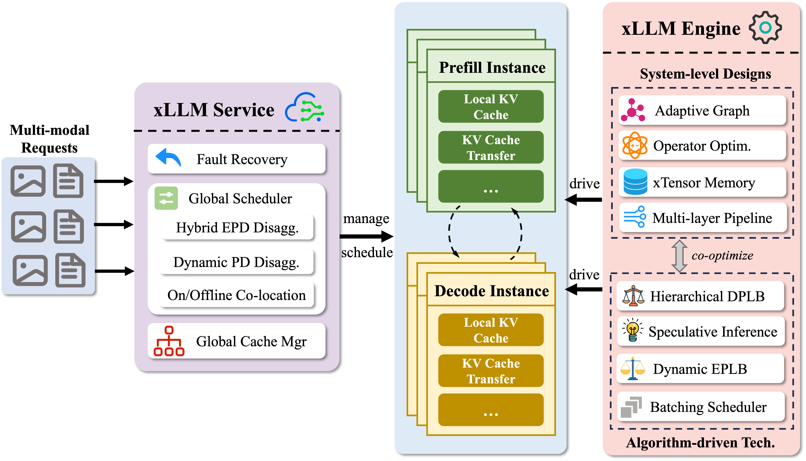

<!-- Copyright 2022 JD Co.

Licensed under the Apache License, Version 2.0 (the "License");
you may not use this project except in compliance with the License.
You may obtain a copy of the License at

    http://www.apache.org/licenses/LICENSE-2.0

Unless required by applicable law or agreed to in writing, software
distributed under the License is distributed on an "AS IS" BASIS,
WITHOUT WARRANTIES OR CONDITIONS OF ANY KIND, either express or implied.
See the License for the specific language governing permissions and
limitations under the License. -->

[English](./README.md) | [中文](./README_zh.md)

<div align="center">

    
[](https://xllm.readthedocs.io/zh-cn/latest/) [](https://hub.docker.com/r/xllm/xllm-ai) [](https://opensource.org/licenses/Apache-2.0) [](https://arxiv.org/abs/2510.14686) [](https://deepwiki.com/jd-opensource/xllm) 
    
</div>

---------------------
<p align="center">
| <a href="https://xllm.readthedocs.io/zh-cn/latest/"><b>Documentation</b></a> |  <a href="https://arxiv.org/abs/2510.14686"><b>Technical Report</b></a> |
</p>

### 📢 新闻

- 2025-12-21: 🎉 我们在第一时间内支持了[GLM-4.7](https://github.com/zai-org)模型的高效推理。
- 2025-12-08: 🎉 我们在第一时间内支持了[GLM-4.6V](https://github.com/zai-org/GLM-V)模型的高效推理。
- 2025-12-05: 🎉 我们支持了[GLM-4.5/GLM-4.6](https://github.com/zai-org/GLM-4.5/blob/main/README_zh.md)系列模型.
- 2025-12-05: 🎉 我们支持了[VLM-R1](https://github.com/om-ai-lab/VLM-R1) 模型.
- 2025-12-05: 🎉 我们基于[Mooncake](https://github.com/kvcache-ai/Mooncake)构建了混合 KV 缓存管理机制，支持具备智能卸载与预取能力的全局 KV 缓存管理。
- 2025-10-16: 🎉 我们最近在 arXiv 上发布了我们的 [xLLM 技术报告](https://arxiv.org/abs/2510.14686)，提供了全面的技术蓝图和实施见解。

## 1. 简介

**xLLM** 是一个高效的开源大模型推理框架，专为**国产芯片**优化设计，提供企业级的服务部署，使得性能更高、成本更低。该框架采用**服务-引擎分离的推理架构**，通过服务层的在离线请求弹性调度、动态PD分离、EPD混合机制及高可用容错设计，结合引擎层的多流并行计算、图融合优化、投机推理、动态负载均衡及全局KV缓存管理，实现推理效率突破性提升。xLLM整体架构和功能如下图所示：

<div align="center">

</div>

**xLLM** 已支持主流大模型（如 *DeepSeek-V3.1*，*Qwen2/3*等）在国产芯片上的高效部署，助力企业实现高性能、低成本的 AI 大模型应用落地。xLLM已全面落地京东零售核心业务，涵盖智能客服、风控、供应链优化、广告推荐等多种场景。


## 2. 核心特性
xLLM 提供了强大的智能计算能力，通过硬件系统的算力优化与算法驱动的决策控制，联合加速推理过程，实现高吞吐、低延迟的分布式推理服务。

**全图化/多层流水线执行编排**
- 框架调度层的异步解耦调度，减少计算空泡；
- 模型图层的计算和通信异步并行，重叠计算与通信；
- 算子内核层的异构计算单元深度流水，重叠计算与访存。

**动态shape的图执行优化**
- 基于参数化与多图缓存方法的动态尺寸适配，提升静态图灵活性；
- 受管控的显存池，保证地址安全可复用；
- 集成适配性能关键的自定义算子（如 *PageAttention*, *AllReduce*）。

**高效显存优化**
- 离散物理内存与连续虚拟内存的映射管理；
- 按需分配内存空间，减少内存碎片与浪费；
- 智能调度内存空间，增加内存页复用，减小分配延迟；
- 国产芯片相应算子适配。

**全局多级KV Cache管理**
- 多级缓存的kv智能卸载与预取；
- 以kv cache为中心的分布式存储架构；
- 多节点间kv的智能传输路由。

**算法优化**
- 投机推理优化，多核并行提升效率；
- MoE专家的动态负载均衡，实现专家分布的高效调整。


---

## 3. 代码结构
```
├── xllm/
|   : 主代码目录
│   ├── api_service/               # api服务化实现
│   ├── core/  
│   │   : xllm核心功能代码目录
│   │   ├── common/                
│   │   ├── distributed_runtime/   # 分布式PD服务实现
│   │   ├── framework/             # 引擎执行模块实现
│   │   ├── kernels/               # 国产芯片kernels适配实现
│   │   ├── layers/                # 模型层实现
│   │   ├── platform/              # 多平台兼容层
│   │   ├── runtime/               # worker/executor角色实现
│   │   ├── scheduler/             # 批调度与PD调度实现
│   │   └── util/
│   ├── function_call              # function call实现
│   ├── models/                    # 模型实现
│   ├── processors/                # 多模态模型预处理实现
│   ├── proto/                     # 通信协议
│   ├── pybind/                    # python接口
|   └── server/                    # xLLM服务实例
├── examples/                      # 服务调用示例
├── tools/                         # NPU Timeline生成工具
└── xllm.cpp                       # xLLM启动入口
```

当前支持模型列表：
- DeepSeek-V3/R1
- DeepSeek-R1-Distill-Qwen
- Kimi-k2
- Llama2/3
- MiniCPM-V
- MiMo-VL
- Qwen2/2.5/QwQ
- Qwen2.5-VL
- Qwen3 / Qwen3-MoE
- Qwen3-VL / Qwen3-VL-MoE
- GLM-4.5 / GLM-4.6 / GLM-4.6V / GLM-4.7
- VLM-R1

---


## 4. 快速开始
#### 安装
首先下载我们提供的镜像：
```bash
# A2 x86
docker pull quay.io/jd_xllm/xllm-ai:xllm-dev-hb-rc2-x86
# A2 arm
docker pull quay.io/jd_xllm/xllm-ai:xllm-dev-hb-rc2-arm
# A3 arm
docker pull quay.io/jd_xllm/xllm-ai:xllm-dev-hc-rc2-arm
# 或者
# A2 x86
docker pull xllm/xllm-ai:xllm-dev-hb-rc2-x86
# A2 arm
docker pull xllm/xllm-ai:xllm-dev-hb-rc2-arm
# A3 arm
docker pull xllm/xllm-ai:xllm-dev-hc-rc2-arm
```
然后创建对应的容器
```bash
sudo docker run -it --ipc=host -u 0 --privileged --name mydocker --network=host  --device=/dev/davinci0  --device=/dev/davinci_manager --device=/dev/devmm_svm --device=/dev/hisi_hdc -v /var/queue_schedule:/var/queue_schedule -v /usr/local/Ascend/driver:/usr/local/Ascend/driver -v /usr/local/Ascend/add-ons/:/usr/local/Ascend/add-ons/ -v /usr/local/sbin/npu-smi:/usr/local/sbin/npu-smi -v /usr/local/sbin/:/usr/local/sbin/ -v /var/log/npu/conf/slog/slog.conf:/var/log/npu/conf/slog/slog.conf -v /var/log/npu/slog/:/var/log/npu/slog -v /export/home:/export/home -w /export/home -v ~/.ssh:/root/.ssh  -v /var/log/npu/profiling/:/var/log/npu/profiling -v /var/log/npu/dump/:/var/log/npu/dump -v /home/:/home/  -v /runtime/:/runtime/ -v /etc/hccn.conf:/etc/hccn.conf xllm/xllm-ai:xllm-dev-hb-rc2-x86
```

下载官方仓库与模块依赖：
```bash
git clone https://github.com/jd-opensource/xllm
cd xllm 
git submodule init
git submodule update
```
编译依赖[vcpkg](https://github.com/microsoft/vcpkg)，镜像中已经提前配置完成。如果您想要手动配置，可以执行如下命令:
```bash
git clone https://gitcode.com/xLLM-AI/vcpkg.git
cd vcpkg && git checkout ffc42e97c866ce9692f5c441394832b86548422c
export VCPKG_ROOT=/your/path/to/vcpkg
```

#### 编译
执行编译，在`build/`下生成可执行文件`build/xllm/core/server/xllm`：
```bash
python setup.py build
```
或直接用以下命令编译在`dist/`下生成whl包:
```bash
python setup.py bdist_wheel
```

#### 执行
运行例如如下命令启动xllm引擎：
```bash
./build/xllm/core/server/xllm \    # 启动 xllm 服务器程序
    --model=/path/to/your/llm  \   # 指定模型路径（需替换为实际路径）
    --port=9977 \                  # 设置服务端口为 9977
    --max_memory_utilization 0.90  # 设置最大内存利用率为 90
```

---

## 5. 成为贡献者
您可以通过以下方法为 xLLM 作出贡献:

1. 在Issue中报告问题
2. 提供改进建议
3. 补充文档
    + Fork仓库
    + 修改文档
    + 提出pull request
4. 修改代码
    + Fork仓库
    + 创建新分支
    + 加入您的修改
    + 提出pull request

感谢您的贡献！ 🎉🎉🎉
如果您在开发中遇到问题，请参阅**[xLLM中文指南](https://xllm.readthedocs.io/zh-cn/latest)**

---

## 6. 社区支持
如果你在xLLM的开发或使用过程中遇到任何问题，欢迎在项目的Issue区域提交可复现的步骤或日志片段。
如果您有企业内部Slack，请直接联系xLLM Core团队。另外，我们建立了官方微信群，可以访问以下二维码加入。欢迎沟通和联系我们:

<div align="center">
  
</div>

---

## 7. 致谢
本项目的实现得益于以下开源项目: 

- [ScaleLLM](https://github.com/vectorch-ai/ScaleLLM) - 采用了ScaleLLM中构图方式和借鉴Runtime执行。
- [Mooncake](https://github.com/kvcache-ai/Mooncake) - 依赖构建了多级KV Cache管理机制。
- [brpc](https://github.com/apache/brpc) - 依赖brpc构建了高性能http service。
- [tokenizers-cpp](https://github.com/mlc-ai/tokenizers-cpp) - 依赖tokenizers-cpp构建了c++ tokenizer。
- [safetensors](https://github.com/huggingface/safetensors) - 依赖其c binding safetensors能力。
- [Partial JSON Parser](https://github.com/promplate/partial-json-parser) - xLLM的C++版本JSON解析器，参考Python与Go实现的设计思路。
- [concurrentqueue](https://github.com/cameron314/concurrentqueue) - 高性能无锁Queue.

感谢以下合作的高校实验室：

- [THU-MIG](https://ise.thss.tsinghua.edu.cn/mig/projects.html)（清华大学软件学院、北京信息科学与技术国家研究中心）
- USTC-Cloudlab（中国科学技术大学云计算实验室）
- [Beihang-HiPO](https://github.com/buaa-hipo)（北京航空航天大学HiPO研究组）
- PKU-DS-LAB（北京大学数据结构实验室）
- PKU-NetSys-LAB（北京大学网络系统实验室）

感谢以下为xLLM作出贡献的[开发者](https://github.com/jd-opensource/xllm/graphs/contributors)

<a href="https://github.com/jd-opensource/xLLM/graphs/contributors">
  
</a>

---

## 8. 许可证

[Apache License](LICENSE)

#### xLLM 由 JD.com 提供 
#### 感谢您对xLLM的关心与贡献!

## 9. 引用

如果你觉得这个仓库对你有帮助，欢迎引用我们：
```
@article{liu2025xllm,
  title={xLLM Technical Report},
  author={Liu, Tongxuan and Peng, Tao and Yang, Peijun and Zhao, Xiaoyang and Lu, Xiusheng and Huang, Weizhe and Liu, Zirui and Chen, Xiaoyu and Liang, Zhiwei and Xiong, Jun and others},
  journal={arXiv preprint arXiv:2510.14686},
  year={2025}
}
```
