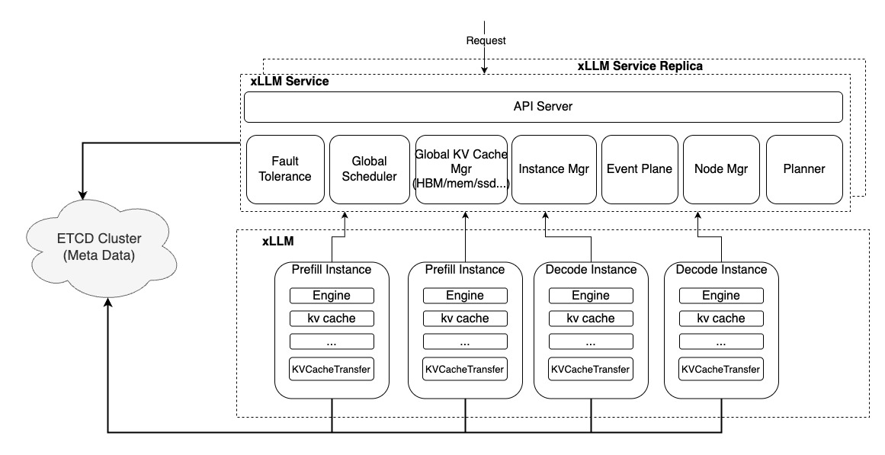

# Disaggregated PD
## Background
LLM online inference services typically need to meet two performance metrics: TTFT and TPOT. Traditional Contiguous Batching scheduling strategies mix Prefill and Decode requests during scheduling, causing Prefill and Decode phases to compete for computational resources. This prevents maximized utilization of computing resources and impacts performance metrics. To resolve this conflict, the Prefill and Decode phases are split to run on independent computational resources, enabling parallel execution. This simultaneously reduces TTFT and TPOT while improving throughput.

## Introduction
The xLLM PD Separation feature is primarily implemented through the following three modules:  

- **etcd**: Stores metadata such as instance information.  
- **xLLM Service**: Schedules requests and manages all computing instances.  
- **xLLM**: Handles request computation instances.  

The overall architecture is shown below: 


## Usage
### Preparation
#### Install Dependencies
- **xLLM**: Refer to [Installation && Compilation](../getting_started/compile.md)
- **xLLM Service**: Refer to [PD disaggregation](../getting_started/PD_disagg.md)

#### Obtain Environment Information  
Deploying Disaggregated PD Service requires obtaining the Device IP of the machine to create communication resources. Execute the command `cat /etc/hccn.conf | grep address` on the current AI Server to get the Device IP, for example:
```
address_0=xx.xx.xx.xx
address_1=xx.xx.xx.xx
```
`address_xx` represents the Device IP.

### Start Disaggregated PD Service
1. Start etcd
```bash
./etcd
```
2. Start xLLM Service
```bash
ENABLE_DECODE_RESPONSE_TO_SERVICE=true ./xllm_master_serving --etcd_addr="127.0.0.1:12389" --http_server_port 28888 --rpc_server_port 28889 --tokenizer_path=/path/to/tokenizer_config_dir/
```
3. Start xLLM  
- Taking Qwen2-7B as an example  
    - Start Prefill Instance
        ``` shell linenums="1" hl_lines="10"
        ./xllm --model=Qwen2-7B-Instruct \
               --port=8010 \
               --devices="npu:0" \
               --master_node_addr="127.0.0.1:18888" \
               --enable_prefix_cache=false \
               --enable_chunked_prefill=false \
               --enable_disagg_pd=true \
               --instance_role=PREFILL \
               --etcd_addr="127.0.0.1:12389" \
               --device_ip=xx.xx.xx.xx \ # Replace with actual Device IP 
               --transfer_listen_port=26000 \
               --disagg_pd_port=7777 \
               --node_rank=0 \
               --nnodes=1
        ```
    - Start Decode Instance 
        ```shell linenums="1" hl_lines="11"  
        ./xllm --model=Qwen2-7B-Instruct \
               --port=8020 \
               --devices="npu:1" \
               --master_node_addr="127.0.0.1:18898" \
               --enable_prefix_cache=false \
               --enable_chunked_prefill=false \
               --enable_disagg_pd=true \
               --instance_role=DECODE \
               --etcd_addr="127.0.0.1:12389" \
               --device_ip=xx.xx.xx.xx \  # Replace with actual Device IP  
               --transfer_listen_port=26100 \
               --disagg_pd_port=7787 \
               --node_rank=0 \
               --nnodes=1
        ```
    Important notes:
    
    - For PD disaggregation when specifying NPU Device, the corresponding `device_ip` is required. This is different for each device. You can see this by executing the following command on the physical machine outside the container environment. The value after `address_{i}=` displayed is the `device_ip` corresponding to `NPU {i}`.

    - `etcd_addr` must match the `etcd_addr` of `xllm_service`

## Notice
Disaggregated PD **does not support** enabling prefix cache or chunked prefill. These features must be disabled using the following parameters:
```shell
--enable_prefix_cache=false  
--enable_chunked_prefill=false  
```
