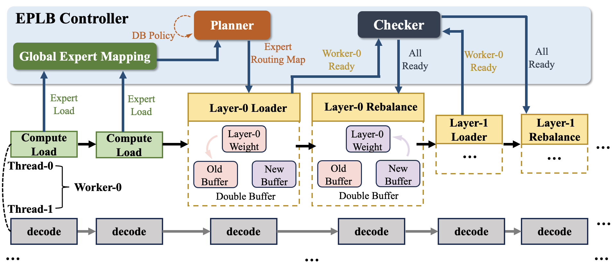

# EPLB

## Background

MoE models rely on dynamic token routing to distribute tokens among experts. However, in real-world deployments, uneven data distribution leads to expert load imbalance (some overloaded while others idle). Expert redundancy adjustment (e.g., adding/removing replicas) consumes additional GPU memory and may impact inference latency due to weight migration, posing significant implementation challenges. To address this, we employ an expert redundancy strategy (replicating hot experts) combined with hierarchical and global dynamic load balancing to achieve dynamic MoE load balancing.

## Features

The xLLM EPLB functionality is implemented through three main modules:

- **EPLB Manager**: Responsible for monitoring expert loads, collecting and managing expert distribution updates. It uses a layer-by-layer update mechanism, determining whether to update each layer based on expert load changes.
- **EPLB Executor**: The actual executor for expert distribution updates.
- **EPLB Policy**: Strategy for generating new expert load tables.

Overall architecture diagram:


## Usage

Simply add the following gflag parameters when launching xLLM:

(Replace with actual number of devices. `ep_size` must match the number of devices)

- xLLM provides the gflag parameter `enable_eplb` (default: false). Set to true in the xLLM service startup script to enable dynamic expert load balancing.
- `expert_parallel_degree` and `ep_size` are MoE-related parameters. `expert_parallel_degree` should be set to `2`, and `ep_size` must match the actual number of NPU/GPU devices. See [moe_params](./moe_params.md)
- `eplb_update_interval` sets the expert distribution update interval in seconds (default: 1000).
- The expert distribution update uses a layer-by-layer mechanism based on expert load. When the similarity between consecutive loads for a layer is below `eplb_update_threshold`, that layer is updated (default: 1, range: 0-1).

```bash
--enable_eplb=true --expert_parallel_degree=2 --ep_size=16 --eplb_update_interval=2000 --eplb_update_threshold=0.9