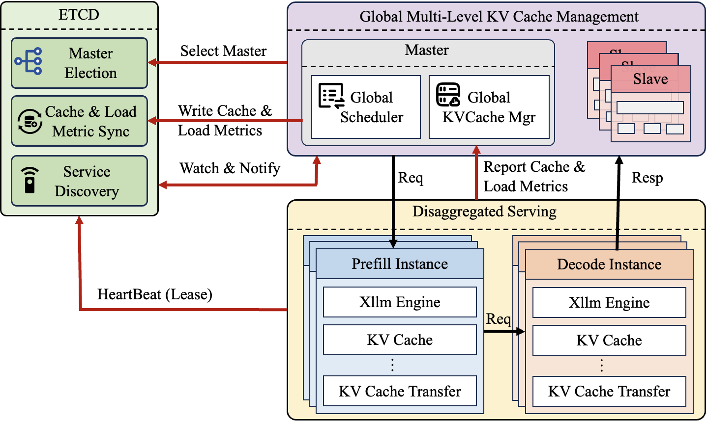

# Global Multi-Level KV Cache

## Background
In the decoding phase of large language models (LLMs), frequent access to historical KV cache due to autoregressive generation creates a bottleneck in memory bandwidth. As model sizes and context windows expand (e.g., 128K Tokens consuming over 40GB of memory), the pressure on single-device memory increases dramatically. Existing solutions (such as vLLM) exhibit significant limitations in long-context scenarios: prefill time surges, severe memory bandwidth contention during decoding, and the need for excessive resource reservation to meet SLO requirements (TTFT < 2s, TBT < 100ms). This often results in GPU utilization below 40% and difficulties in leveraging cross-server resources. To address this, we propose a distributed global multi-level KV cache management system, adopting a memory-compute integrated architecture to break through single-machine resource constraints.

## Feature Introduction
The xLLM Global KV Cache feature is primarily implemented through the following three modules:
-   **etcd**: For cluster service registration, load information synchronization, and global cache state management.
-   **xLLM Service**: For scheduling requests and managing all compute instances.
-   **xLLM**: The compute instances handling requests.

The overall architecture is shown in the diagram below:


## Usage Example

### Preparation

#### Install Dependencies
-   **etcd**: [etcd Installation Guide](https://etcd.io/docs/v3.6/install/)
-   **xLLM Service**: Refer to the xLLM Service compilation documentation.
-   **xLLM**: Refer to the xLLM compilation documentation.

### Usage Instructions

1.  **etcd Startup Configuration:**
    ```
    ./etcd --listen-peer-urls=http://0.0.0.0:10999 --listen-client-urls=http://0.0.0.0:10998
    ```

2.  **xLLM Service Startup Configuration:**
    ```
    ENABLE_DECODE_RESPONSE_TO_SERVICE=true ./xllm_master_serving --etcd_addr="127.0.0.1:10998" --http_server_port 28888 --rpc_server_port 28889 --tokenizer_path=/path/to/tokenizer_config_dir/
    ```

3.  **xLLM Startup Configuration:**
    Add the following gflag parameters when starting xLLM:
    ```
    --enable_service_routing=true
    --enable_cache_upload=true
    # Global KVCache currently does not support PD separation
    --enable_disagg_pd=true
    ```