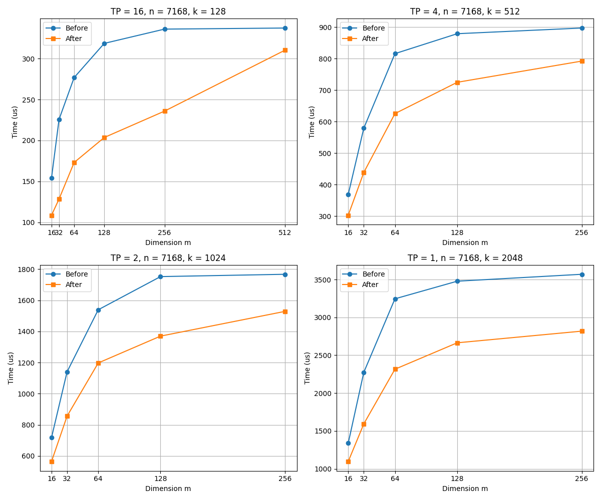

# GroupGEMM Operator Optimization

## Background
The Mixture of Experts (MoE) architecture has become an important paradigm for scaling large language models. Its core idea is to dynamically route input tokens to different expert sub-networks for processing. During inference, the GroupGEMM operator is a key computational unit in the MoE architecture, responsible for efficiently executing parallel computations of multiple expert matrix multiplications, which dominate the overall inference time.

## Function Introduction
Considering the current performance bottleneck of GroupGEMM being I/O constrained, an optimization scheme is proposed that replaces data copying with index reordering, eliminating multiple copies of the token vector and instead maintaining an index table for expert allocation. Through this line number index, tokens are directly mapped to the corresponding expert computation units, and the allocation scheduling of tokens is fused with matrix multiplication into a single kernel.

## User Interface

### Operator Direct Call API
```c++
aclnnStatus aclnnIndexGroupMatmulGetWorkspaceSize(
    const aclTensorList *x,
    const aclTensorList *weight,
    const aclTensorList *scale,
    const aclTensorList *perTokenScale,
    const aclTensor *groupList,
    const aclTensorList *out,
    uint64_t *workspaceSize,
    aclOpExecutor **executor);

aclnnStatus aclnnIndexGroupMatmul(
    void *workspace,
    uint64_t workspaceSize,
    aclOpExecutor *executor,
    aclrtStream stream);
```

- `x`: The input tensor list containing the data to be processed.
- `weight`: The weight tensor containing the model parameters.
- `scale`: The scaling factor used to adjust the values of the input tensors.
- `perTokenScale`: The scaling factor for each token, used for dynamic adjustment.
- `groupList`: The list of expert groups indicating which experts participate in the computation.
- `out`: The output tensor list that stores the computation results.

## Performance Effects


* The optimized GroupMatmul operator shows significant advantages in computation time, especially when \( k = 128 \) and \( m = 64 \). As shown in the figure, the computation delay of the optimized operator is **reduced by 50%**.