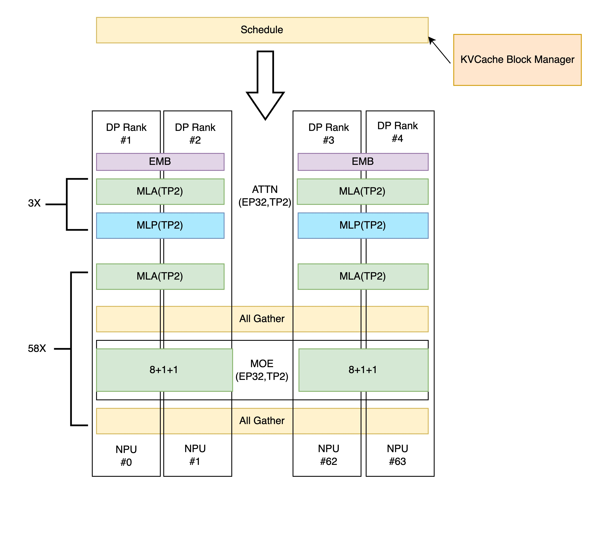

# EP Parallelism

## Background

When deploying the DeepSeek-R1 671B parameter-scale model, traditional distributed deployment faces core bottlenecks including low GPU memory utilization, high communication overhead, and expensive hardware costs. Therefore, Expert Parallelism (EP) is introduced.

Key advantages:
+ With the same resources, fewer Experts per GPU means more memory available for KV Cache, allowing more tokens to be cached.
+ Due to MLA characteristics, smaller TP Size with the same resources means less redundant KV Cache, enabling more tokens to be cached.
+ Large-scale EP deployment can concentrate token computations for the same expert on the same device, improving hardware utilization.

## Parameter Configuration

+ **dp_size**: Sets the data parallelism scale for the Attention part. Default: 1, can be set to powers of 2. When dp_size doesn't equal the total number of devices, TP parallelism is used within the DP group.
+ **ep_size**: Sets the expert parallelism scale for the MoE part. Default: 1, can be set to powers of 2. When ep_size doesn't equal the total number of devices, TP parallelism is used within the DP group.
+ **enable_mla**: Default: false. Set to true when using MLA in the model.
+ **expert_parallel_degree**: EP-related parameter. Default is 0 when EP is disabled. When EP is enabled, default is 1 (EP Level 1). When ep_size equals the total number of devices, can be set to 2 to enable EP Level 2.

## Solution Design

+ When EP is enabled (default EP Level 1), after computing both Attention and MoE parts, data is sent to the next stage via All Gather communication across all devices. Example for 64 devices (Attention: dp32tp2, MoE: ep32tp2):

+ When ep_size equals the total number of devices, EP Level 2 can be enabled. Communication between Attention and MoE parts changes to ALL2ALL, sending data only to required devices to reduce communication volume and overhead. Example for 64 devices:
