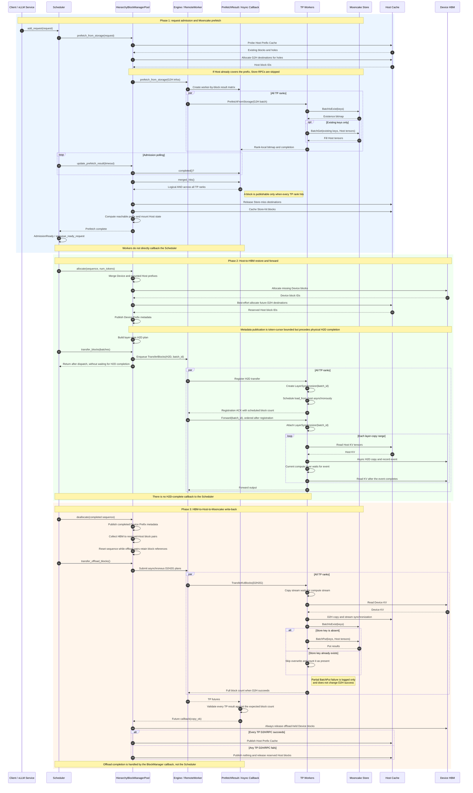
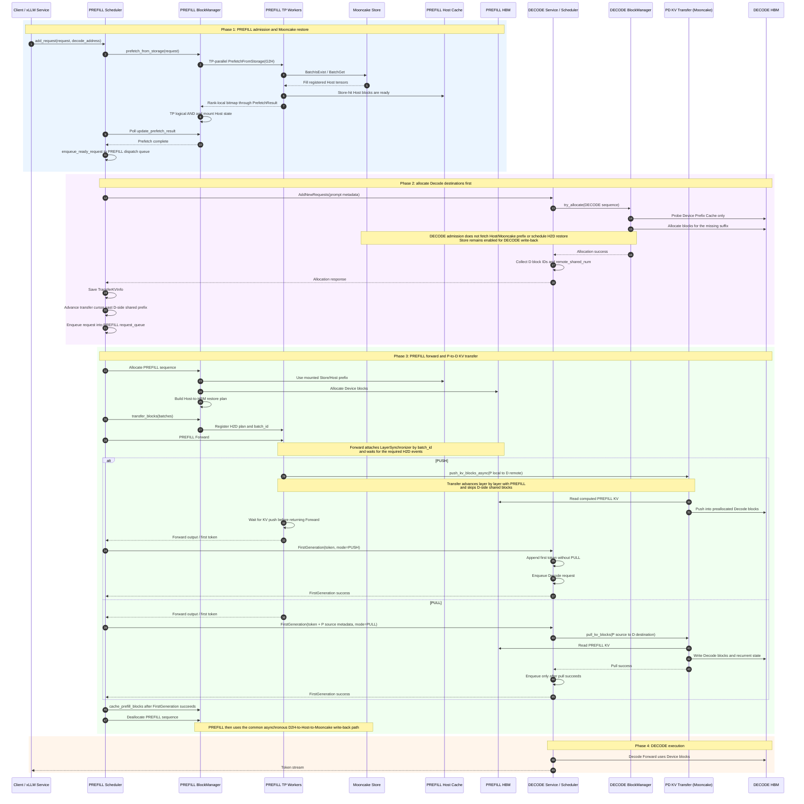

## Background

Long-context inference repeatedly reads historical KV cache during autoregressive decoding. As model sizes and context windows grow, device memory capacity and bandwidth become major constraints. A device-only cache also makes a cold request recompute a prefix even when the same prefix was produced by an earlier request or another xLLM instance.

xLLM extends the device prefix cache into a three-level hierarchy:

| Tier | Purpose | Lifetime |
|---|---|---|
| Device HBM | Lowest-latency KV used by the current forward pass | Device-local |
| Host cache | Pinned CPU-memory staging and reusable host prefix cache | xLLM process |
| Mooncake Store | Distributed KV objects shared across xLLM processes and restarts | Store cluster |

A request first checks the Host prefix cache. Missing full blocks can be fetched from Mooncake Store into preallocated Host blocks, restored to HBM layer by layer, and reused without recomputing the matched prefix. Completed HBM blocks are asynchronously copied back to Host memory and then written to Mooncake Store.

## Architecture

The deployment can contain the following components:

- **etcd**: Registers compute instances and synchronizes service metadata.
- **xLLM Service**: Routes requests and manages fused or disaggregated Prefill/Decode instances.
- **xLLM**: Owns the device and Host KV caches and executes inference.
- **Mooncake Store**: Provides the distributed, process-independent KV object tier.

The service-level architecture is shown below:


## Block Lifecycle

Fused instances and the Prefill side of disaggregated PD use the complete Mooncake admission, Host restore, and write-back path. Decode keeps Store enabled for its Host/Mooncake write-back path, while its request-admission path remains Device-prefix-only.



## Disaggregated PD

In disaggregated PD, Mooncake Store admission and Host-to-HBM restore run on the **Prefill** instance. The Decode instance allocates destination Device blocks before Prefill starts and only probes its Device Prefix Cache during admission; it does not mount Host aliases, fetch a prefix from Mooncake, or schedule Host-to-Device restoration. Decode still enables Store and Host cache capacity for its write-back path.



Both `PUSH` and `PULL` are supported by the scheduler path. `kv_cache_transfer_type` defaults to `Mooncake`; the examples below set it explicitly for clarity. Enable the global Mooncake Store tier on both Prefill and Decode, using disjoint `store_local_hostname` base-port ranges.

## Deployment

### Prerequisites

- Build and install [xLLM](/en/getting_started/quick_start/).
- Install [xLLM Service](https://github.com/xLLM-AI/xllm-service) when service routing or disaggregated PD is required.
- Build or install the Mooncake Store `mooncake_master` and `mooncake_client` binaries.
- Reserve enough Host memory. Mooncake Store requires `--enable_prefix_cache=true` and `--host_blocks_factor > 1`.

For Mooncake's etcd-backed high availability mode, install Go first and explicitly enable the HA backends when building xLLM and the bundled Mooncake binaries:

```bash
MAX_JOBS=32 SKIP_EXPORT=1 \
  python setup.py build --device npu --enable-ha true
cmake --build build/cmake.linux-aarch64-cpython-311 \
  --target mooncake_master mooncake_client -j32
```

Ready-to-use HA master, independent Store client, and xLLM argument scripts are available under `scripts/kvcache_store/`.

### Start a Minimal Mooncake Store

The following TCP example uses Mooncake's P2P handshake, so no separate Transfer Engine metadata service is required:

```bash
export MC_STORE_CLUSTER_ID=xllm-mooncake

mooncake_master \
  --rpc_address=0.0.0.0 \
  --rpc_port=50051
```

Start at least one resource-owning Store client:

```bash
mooncake_client \
  --host=0.0.0.0:50053 \
  --port=50052 \
  --global_segment_size=4GB \
  --master_server_address=127.0.0.1:50051 \
  --metadata_server=P2PHANDSHAKE \
  --protocol=tcp
```

### Start a High-Availability Mooncake Store Cluster

First start an etcd cluster reachable by every Mooncake master. Then start one master instance on each master node. All instances use the same etcd endpoints and `cluster_id`, while `rpc_address` must identify the reachable address of that specific instance:

```bash
mooncake_master \
  --enable_ha=true \
  --ha_backend_type=etcd \
  --ha_backend_connstring="10.0.0.1:2379;10.0.0.2:2379;10.0.0.3:2379" \
  --cluster_id=xllm-mooncake \
  --rpc_address=10.0.1.11 \
  --rpc_port=50051
```

Store clients and xLLM use etcd to discover and follow the current leader instead of binding to one master address:

```bash
export MC_STORE_CLUSTER_ID=xllm-mooncake
MOONCAKE_HA_ENTRY='etcd://10.0.0.1:2379;10.0.0.2:2379;10.0.0.3:2379'

mooncake_client \
  --host=0.0.0.0:50053 \
  --port=50052 \
  --global_segment_size=4GB \
  --master_server_address="${MOONCAKE_HA_ENTRY}" \
  --metadata_server=P2PHANDSHAKE \
  --protocol=tcp

/path/to/xllm \
  --enable_prefix_cache=true \
  --host_blocks_factor=4 \
  --enable_kvcache_store=true \
  --store_protocol=tcp \
  --store_master_server_address="${MOONCAKE_HA_ENTRY}" \
  --store_metadata_server=P2PHANDSHAKE \
  --store_local_hostname=127.0.0.1:12345
```

The `etcd://` prefix in `store_master_server_address` selects the HA leader-discovery backend. Do not add `http://` to the endpoint list after that prefix. When using a custom `cluster_id`, every Mooncake master, Store client, and xLLM process must use the same `MC_STORE_CLUSTER_ID`.

### Start etcd and xLLM Service

This step is required for service routing and disaggregated PD, but not for a standalone fused xLLM process:

```bash
./etcd \
  --listen-peer-urls=http://0.0.0.0:10999 \
  --listen-client-urls=http://0.0.0.0:10998
```

```bash
./xllm_master_serving \
  --etcd_addr=127.0.0.1:10998 \
  --http_server_port=28888 \
  --rpc_server_port=28889 \
  --tokenizer_path=/path/to/tokenizer_config_dir/
```

### Fused xLLM Example

```bash
/path/to/xllm \
  --model=/path/to/model \
  --model_id=my-model-revision-v1 \
  --enable_prefix_cache=true \
  --host_blocks_factor=4 \
  --enable_kvcache_store=true \
  --store_protocol=tcp \
  --store_master_server_address=127.0.0.1:50051 \
  --store_metadata_server=P2PHANDSHAKE \
  --store_local_hostname=127.0.0.1:12345 \
  --prefetch_batch_size=8 \
  --prefetch_timeout=30000
```

`store_local_hostname` is a base Transfer Engine endpoint. Each worker uses `base_port + worker_rank`, so the entire port range must be free and reachable.

For RDMA, set `--store_protocol=rdma` and export `DEVICE_NAMES` with the Mooncake RDMA devices. If `DEVICE_NAMES` is absent, xLLM falls back to TCP.

### Disaggregated PD Example

Use the normal [Disaggregated PD](/en/features/disagg_pd/) flags and enable Store on both roles. Use different `store_local_hostname` base ports for Prefill and Decode:

```bash
/path/to/xllm \
  --enable_disagg_pd=true \
  --instance_role=PREFILL \
  --kv_cache_transfer_type=Mooncake \
  --kv_cache_transfer_mode=PUSH \
  --enable_prefix_cache=true \
  --host_blocks_factor=4 \
  --enable_kvcache_store=true \
  --store_protocol=tcp \
  --store_master_server_address=127.0.0.1:50051 \
  --store_metadata_server=P2PHANDSHAKE \
  --store_local_hostname=127.0.0.1:12345
```

Enable Store on Decode with a different local endpoint range:

```bash
/path/to/xllm \
  --enable_disagg_pd=true \
  --instance_role=DECODE \
  --kv_cache_transfer_type=Mooncake \
  --kv_cache_transfer_mode=PUSH \
  --enable_prefix_cache=true \
  --host_blocks_factor=4 \
  --enable_kvcache_store=true \
  --store_protocol=tcp \
  --store_master_server_address=127.0.0.1:50051 \
  --store_metadata_server=P2PHANDSHAKE \
  --store_local_hostname=127.0.0.1:13345
```

See the [CLI Reference](/en/cli_reference/) for all `KVCacheStoreConfig` parameters.

## Correctness and Operational Notes

- A Store-fetched block is mounted into the Host Prefix Cache only when **every TP rank** reports a hit for that block.
- `prefetch_timeout` stops issuing new prefetch batches after the timeout, but admission still waits for every in-flight TP batch to finish. `0` waits indefinitely.
- H2D registration does not wait for the physical copy. Forward attaches a `LayerSynchronizer` using `batch_id` and waits at the corresponding layers. The Scheduler receives no H2D-complete callback.
- Host Prefix publication after write-back is gated by successful D2H/RPC results from every TP rank. Mooncake `BatchPut` is best-effort; a partial Store write failure is logged but does not invalidate a successful Host copy.
- Existing Store objects are not overwritten. Use a unique `model_id` for every weight/configuration revision and rotate or clean the Store namespace when a checkpoint changes.
- In PD, Prefill and Decode both enable Store. They must use disjoint `store_local_hostname` base-port ranges because both roles reuse worker ranks and each worker binds `base_port + worker_rank`.
