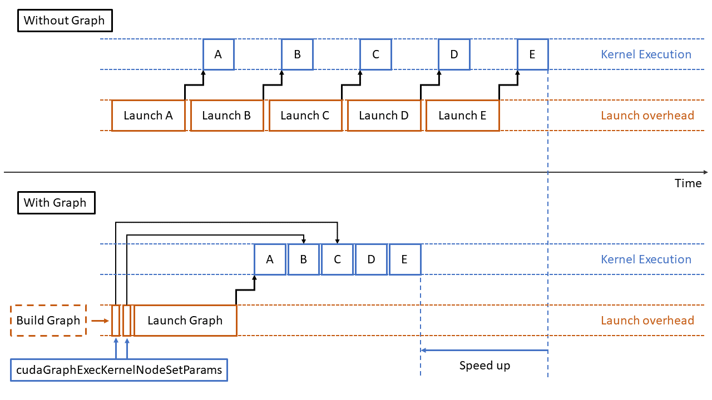
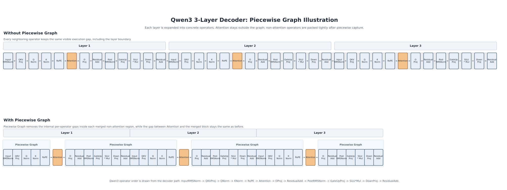
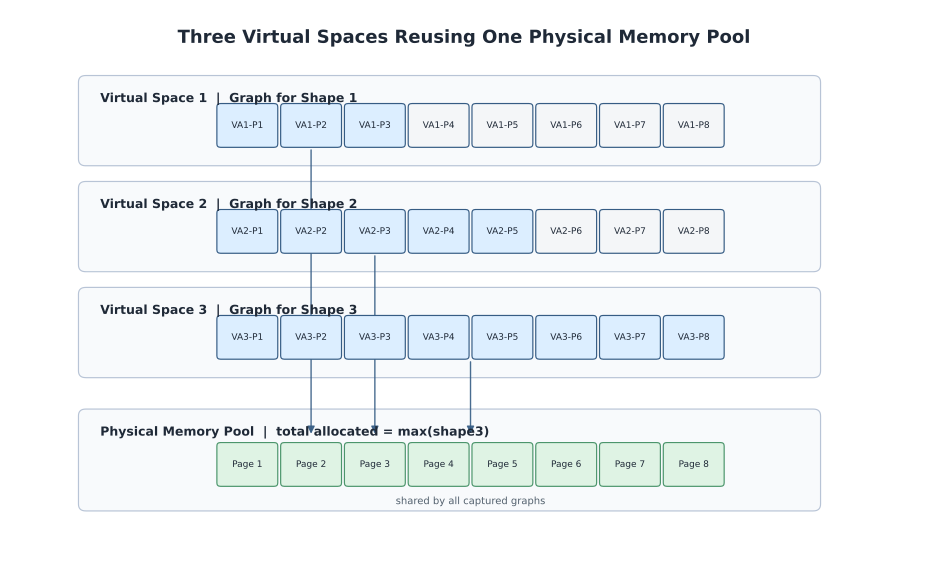

# Graph Mode 设计文档

## 概述

xLLM 的 Graph Mode 覆盖多种图执行后端。其目标是在推理服务场景中，将原本由 Host 频繁发起的小粒度 kernel 启动，转化为先捕获、后重放的图执行流程，从而降低 Host 调度开销、减少设备气泡，并提升吞吐和时延稳定性。

本文档面向需要理解实现原理和关键设计的开发者，重点介绍以下内容：

- Graph Mode 的原理与在 xLLM 中的落地方式
- 动态维度参数化
- Piecewise Graph
- 多 Shape 复用的显存池（含输入 Tensor 复用）

本文聚焦 Graph Mode 的统一设计，不展开不同后端之间的差异。

本文档的设计目标包括：

- 统一 xLLM 在不同图执行后端上的 Graph Mode 抽象
- 解释动态维度参数化、Piecewise Graph 与多 Shape 显存复用三项关键设计
- 说明这些设计分别解决什么问题、依赖什么前提、边界在哪里

本文档的非目标包括：

- 不覆盖所有算子或所有模型的适配细节
- 不替代功能文档中的参数说明与使用示例

相关设计文档：

- 若希望看一个更偏业务推理场景、并且聚焦固定调度、多步执行和定制算子的案例，可参考：[生成式推荐设计文档](generative_recommendation_design.md)

## 1. Graph Mode 原理和在 xLLM 中的落地

### 1.1 Graph Capture / Replay 的基本原理

传统 eager 执行模式下，模型一次 forward 会由 Host 连续发起大量 kernel、memcpy 和同步操作。对于 decode 这类单 step 计算较小但请求频繁的场景，Host 调度开销会比较显著，设备端也更容易出现执行气泡。

Graph Mode 的基本思路是：

1. **Capture 阶段**：第一次遇到某个 shape bucket 时，在专用 stream 上执行一次 forward，并把这条执行路径上的 kernel 启动、内存操作和依赖关系记录成图。
2. **Replay 阶段**：后续相同 bucket 的请求，不再由 Host 逐个下发 kernel，而是直接重放已捕获的图。




这类机制通常要求：

- **执行路径稳定**
  - graph capture 记录的是一次具体执行路径；capture 完成后，这条路径上的控制流、launch 形态和依赖关系就被固化下来
  - 因此，capture 路径中无法在 replay 时再切换到另一套动态条件分支
- **关键 Tensor 地址稳定**
  - capture 期间写入图中的关键 Tensor 地址，在 replay 时必须仍然可用
- **算子与结果语义稳定**
  - replay 的正确性依赖路径上的算子与 Graph Mode 兼容，且不会因为运行时条件变化而改变语义

### 1.2 xLLM GraphMode 基础工作

从 1.1 的三条基本要求出发，前两项主要由 xLLM 运行时负责：一是把动态请求整理成可稳定 replay 的执行单元，二是保证 replay 时仍然访问 capture 阶段记录下来的固定地址。为此，xLLM 在 Graph Mode 下引入了统一的 Graph Executor，负责收敛分桶、持久化 buffer、graph cache 以及 capture / replay 生命周期管理。

xLLM 在运行时侧需要完成的基础工作，主要包括：

- **围绕执行路径稳定的图选择与执行调度**
  - 请求需要先按 `num_tokens` 或相近 shape 归入 bucket
  - bucket 维度维护 graph cache：已命中则直接 replay，未命中则先 capture 再缓存
  - 对可整图捕获的路径执行完整图；存在 break graph 的路径则切换到 Piecewise Graph
- **围绕地址稳定的持久化 buffer 与 graph instance 管理**
  - tokens、positions、seq_lens、block_tables 等动态输入不能在 replay 前重新分配到任意新地址， xLLM 需要先把这些输入写入持久化 buffer，再在固定地址上更新内容
  - 模型计算图过程临时分配的Tensor都需要持久化保存对对应的graph instance中，不能随着作用域结束触发Tensor回收
  - 启用共享内存池后，不同 shape 的 capture 可以复用同一组底层物理内存，但 graph 看到的虚拟地址仍需保持稳定
- **统一的 Graph Executor 封装**
  - capture、cache、replay、图实例管理以及后端差异屏蔽，都需要由运行时统一处理
  - 这层封装的目的，是把 Graph Mode 的运行时组织逻辑从模型实现中剥离出来，而不是把它们散落到各个 layer 或算子里

在具体执行上，Graph Executor 的运行时流程可以概括为：

1. **请求分桶**：按 `num_tokens` 或相近 shape 归类到 bucket
2. **输入准备**：将 tokens、positions、seq_lens、block_tables 等写入持久化 buffer，并更新 `attn_metadata`、`plan_info` 等动态元数据
3. **capture 或 replay 决策**：bucket 已命中则直接 replay；未命中则先 capture、缓存图，再进入 replay 路径
4. **执行图**：按场景执行完整图或 Piecewise Graph

而 1.1 中第三项“算子与结果语义稳定”，更多落在模型和算子本身的适配上，见 1.3。

### 1.3 模型适配 Graph Mode 需要的改造

在 xLLM 运行时负责分桶、buffer 和 graph instance 管理之后，模型侧仍然需要解决 1.1 中第三项要求：保证 capture / replay 期间的算子行为与结果语义稳定，不会因为 host 参与、dispatch 变化或 launch 形态变化而失效。

模型适配 Graph Mode 需要的改造主要包括：

- **去掉不支持 capture 的操作**
  - 泛化要求：capture 路径中不能包含会触发 host 参与决策、host-device 隐式同步或额外控制流切换的操作，例如 stream 同步、读取 host tensor 决定逻辑分支、隐式 host-device 同步交互等
  - 典型示例 1：算子内部依赖 host tensor 内容决定任务划分或执行模式。例如商发 8.3 的 ATB [PA](https://www.hiascend.com/document/detail/zh/canncommercial/83RC1/API/ascendtbapi/ascendtb_01_0197.html) 和 [MLA](https://www.hiascend.com/document/detail/zh/canncommercial/83RC1/API/ascendtbapi/ascendtb_01_0314.html)，会根据 host 侧kv_seq_lens和q_seq_lens来做不同的任务排列。
  - 典型示例 2：host 标量参与 Tensor 计算，或 host 侧直接读取 Tensor 数据，例如：

```cpp
Tensor a;
Tensor b = a * 0.5;  // 标量会被隐式传到 tensor 所在设备，产生同步 h2d

torch::Tensor max_of_seq = torch::max(input_params.kv_seq_lens);
max_seq_len_ = std::max(max_of_seq.item<int>(), max_seq_len_);  // host 读取 tensor
```

- **算子适配**
  - 泛化要求：需要保证计算图的 kernel 执行路径稳定。对于同一个输入 shape，每次执行计算图选择的 kernel 应保持一致，不发生 prefill、chunked prefill、decode 混杂；同时 `grid_dim`、`block_dim`、task 数量、workspace 形态和 tiling 内容也不能变化
  - 典型示例：Ascned Cann商发8.3版本 的 ATB PA 会根据序列长度和 batch size 实时决定是否启用 flash-decoding 长序列模式；长序列模式和短序列模式的 tiling key 不同，dispatch 后实际 launch 的 `kernel_name` 也不同。这种“同一业务路径、不同运行时条件触发不同 kernel”的行为，在进入 Graph Mode 前需要先收敛

## 2. 动态维度参数化

### 2.1 问题

Graph Capture 记录的是固定的 kernel 执行序列和 launch 形态。Replay 时，运行时只能重复这套已经记录下来的 `grid_dim`、`block_dim`、task 数量和 tiling 路径，不能在同一张图里重新决定它们。

因此，请求里的动态维度进入 Graph Mode 后，并不都能在 replay 时继续变化。对 attention 来说，真实动态因素通常不止 `num_tokens`，还包括 `batch_size`、`q_seq_lens`、`kv_seq_lens`、`block_tables_size` 等。如果这些维度进一步影响 task 划分、workspace 布局、`tiling_params` 或 kernel 路径，那么 replay 就会沿用 capture 时的旧配置，从而出错。

本章要解决的问题就是：哪些动态信息可以在图选定后继续更新，哪些必须通过分桶或重新建图处理。

### 2.2 解法

动态维度参数化的解法，不是“让一张图接受任意 `num_tokens`”，而是在**图已经按 `bucket_num_tokens` 选定之后**，让同一个 bucket 尽量覆盖更多真实动态请求。

#### 2.2.1 参数化边界

一个维度能不能在 replay 时变化，关键不在于它是不是“请求里的动态值”，而在于它有没有在 capture 阶段被折叠进图的执行形态。

可以把动态因素分成两类：

1. **决定图形态的维度**
   - 一旦进入 `grid_dim`、`block_dim`、task 数量、workspace 布局、tiling key 或 `tiling_params`，它就成为 capture 结果的一部分
   - 这类维度变化后，通常不能在同一张 graph 内直接修改

2. **图选定后仍可更新的维度**
   - 例如 `batch_size`、`q_seq_lens`、`kv_seq_lens`、`block_tables`、`new_cache_slots`、`plan_info`
   - 它们只有在不改写执行形态时，才适合作为参数化对象

一个简化后的 norm kernel 例子是：

```cpp
int grid_dim = num_tokens;
NormKernel<<<grid_dim, block_dim>>>(x, y, ...);
```

这里的 `grid_dim`、`block_dim` 都属于 launch params。只要 `num_tokens` 已经参与了 launch 配置，它就属于图形态的一部分；capture 完成后，replay 就不能在同一张图里把 `grid_dim = 128` 改成 `grid_dim = 256`。

因此，动态维度参数化的判断标准很直接：凡是会改变 launch、workspace 或 tiling 路径的动态因素，都不应只靠 replay 前改参数解决。

#### 2.2.2 xLLM 中的处理方式

xLLM 的处理方式分两层。

第一层先处理 `num_tokens`：通过 bucket 化和 padding，把原始请求归一化到固定的 `bucket_num_tokens`，再据此选定图。

第二层再处理 bucket 内剩余的动态信息：对依赖 host tensor、host planning 或 host 侧 tiling 的算子做改造，把真正随请求变化的信息放到设备侧持久化 buffer 中，或者显式外置为 replay 前可更新的数据，而不是让 replay 继续绑定 capture 时那次 host 侧 planning 结果。

以 NPU attention 为例，改造前常见的问题是：`q_seq_lens`、`kv_seq_lens` 先在 Host 侧参与 planning，生成 task、workspace 或 tiling 相关数据，再发射 kernel：

```cpp
// Host side
auto plan_info = PlanAttention(q_seq_lens_host, kv_seq_lens_host, ...);
WritePlanToWorkspace(attention_workspace, plan_info);

AttentionKernel<<<grid_dim, block_dim>>>(
    q, k, v, out,
    attention_workspace,
    tiling_params);
```

这类实现里，graph replay 不会自动重做 planning，因此只能重复 capture 时那次 launch 和那次 workspace 布局。改造后的方向是，在固定 launch 形态下，把 `q_seq_lens`、`kv_seq_lens`、`block_tables_size`、`plan_info` 等动态信息写入设备侧持久化 buffer，再由 kernel 在执行时读取，例如`kv_seq_lens`的参数化示例：

```cpp
struct AttentionLaunchArgs {
  void* q;
  void* k;
  void* v;
  void* out;
  int32_t batch_size;
  int32_t* kv_seq_lens;   // device buffer
  void* attention_workspace;
  void* tiling_params;
};

LaunchAttentionKernel(args);
```

如果某个动态因素一旦变化就会改写任务数量、数组长度、workspace 形态或 tiling 路径，那么 xLLM 不会强行把它塞进“参数化更新”里，而是采用两种处理方式之一：

1. 扩大分桶维度，把这些因素纳入选图键，例如 `num_tokens` 和 `num_comm_tokens` 的组合
2. 把这段对动态 shape 敏感的执行留在 full graph 之外，交给 Piecewise Graph 处理

### 2.3 结果

动态维度参数化的直接结果是：同一个 `num_tokens` bucket 可以安全覆盖更多真实请求；在执行形态稳定的前提下，attention 等算子也能在 replay 时看到正确的 `batch_size`、`seq_lens`、`block_tables_size`、`plan_info` 等动态信息。

需要注意的是，参数化并不等于取消分桶。`num_tokens` 的动态性仍主要通过选图吸收；如果同一个 bucket 下还有其他会改写 tiling key、任务数量、通信规模或 kernel 路径的因素，那么这些因素仍然必须进入分桶键，或者转为 Piecewise Graph。通信相关场景就是典型例子，例如 Attention DP + MoE EP 下，通信规模可能取决于最大 DP Data Size，而不完全等于单卡本地的 `num_tokens`。

## 3. Piecewise Graph

### 3.1 问题

在 prefill、chunked prefill 等场景中，整条 forward 路径往往比 decode 更复杂。某些算子可能：

- 无法被稳定 capture
- 对动态元数据高度敏感
- 在 capture 模式下依赖额外的运行时准备逻辑

如果要求“整图都必须可捕获”，Graph Mode 的适用范围会非常受限。只要有一个关键算子 break graph，整条路径都无法使用图执行。

### 3.2 解法

#### 3.2.1 底层逻辑

在实现上，一个经常被问到的问题是：为什么 decode 可以使用 full graph，而 chunked prefill 往往只能使用 Piecewise Graph？

关键差别在 attention。

在当前 decode 语义下，单步通常是“每个序列生成一个 token”，因此 `num_tokens` 与 `batch_size` 基本是一一对应的。对 attention 来说，这意味着：

- `num_tokens` 增长时，`batch_size` 也同步增长
- `q_seq_lens` 的模式相对稳定
- 任务划分、workspace 需求和 launch args 变化主要可以跟着 `num_tokens` 一起分桶

因此，按 `num_tokens` 建 bucket 时，decode 路径满足 full graph 的复用条件。

但在 chunked prefill 中，`num_tokens` 和 `batch_size` 不再绑定。相同的 `num_tokens`，可能对应完全不同的请求组合，例如：

- `num_tokens = 128, batch_size = 2, q_seq_lens = [64, 64]`
- `num_tokens = 128, batch_size = 4, q_seq_lens = [32, 32, 32, 32]`
- `num_tokens = 128, batch_size = 8, q_seq_lens = [16, 16, 16, 16, 16, 16, 16, 16]`

对 attention 算子来说，这些请求虽然 `num_tokens` 相同，但并不是同一种 shape。attention 的任务数量划分、本地索引、`q_seq_lens` / `kv_seq_lens` 的长度、以及对应的 `plan_info` 都和 `batch_size` 有直接关系。如果系统只按 `num_tokens` 去复用之前记录的 graph，那么 attention 在 replay 时就可能沿用 capture 阶段那套“旧的 batch 划分”和“旧的任务分块”，从而导致结果错误。

这里的 `batch_size` 之所以难以简单参数化，是因为它影响的不只是某个标量值，而是整组 launch args 的结构：

- `q_seq_lens` / `kv_seq_lens` 数组长度会变
- attention 的任务数量和任务边界会变
- `plan_info` 和 workspace 布局会变
- kernel 内部使用的索引和分块逻辑会变

换句话说，`batch_size` 在 chunked prefill 中不是“改几个参数就行”的维度，而是会改变 attention 这一段图的执行形态。除非把 `num_tokens × batch_size` 甚至更细粒度的 `seq_lens` 组合都纳入分桶，也就是做高维笛卡尔积建图，否则仅靠 `num_tokens` 选图并不安全。

这也是为什么当前实现更适合：

- **decode**：attention 可以随 full graph 一起捕获
- **chunked prefill**：attention 留在图外，其他稳定部分进入 Piecewise Graph

#### 3.2.2 核心思路

Piecewise Graph 的目标不是强行整图捕获，而是把一条完整执行路径拆成多个 piece：

- 可图化的部分：捕获为多个子图
- 不适合图化的部分：保留为 eager 形式

在 replay 时，再按 capture 期间记录的顺序，把这些 piece 串起来执行。

这样可以在“无法整图”的前提下，尽量保留 Graph Mode 的收益。

下图以三层 Qwen3 decoder 为例展开了 Piecewise Graph 的执行顺序：attention 保留为独立 runner，而两次 attention 之间的非 attention 算子会被尽量压紧并组织成连续的 graph piece。



#### 3.2.3 xLLM 中的实现方式

在 xLLM 中，Piecewise Graph 主要用于 prefill 类场景，由 `enable_prefill_piecewise_graph` 控制。

它的核心实现方式是：

1. 使用 `PiecewiseGraphs` 维护 replay 指令序列
2. 可捕获片段以图对象形式保存
3. attention 这类不直接进入图的部分，通过 `AttentionRunner` 记录为 runner
4. replay 时按原始顺序执行 `graph -> runner -> graph -> ...`

这套机制的关键点在于 attention 的处理：

- 在 piecewise capture 期间，attention 会暂时结束当前图捕获
- attention 本身不在 capture 时执行，而是把运行 attention 所需的张量、workspace 和参数保存下来
- replay 时，再基于最新的 `plan_info`、`q_cu_seq_lens`、`kv_cu_seq_lens` 执行 attention

这样做的直接原因就是：chunked prefill 下 attention 的动态维度不只由 `num_tokens` 决定，而当前图分桶主要按 `num_tokens` 组织。把 attention 留在图外，才能避免“同样的 `num_tokens` 命中了 graph，但 `batch_size` 和 `seq_lens` 已经变了”的 replay 错误。

因此，Piecewise Graph 的本质不是“图内支持 attention 的所有动态逻辑”，而是：

- 让可稳定 capture 的部分进入图
- 让对动态 shape 更敏感的 attention 保持单独执行
- 通过统一指令序列保证整条执行路径顺序不变

### 3.3 结果

这套做法带来的结果和边界主要体现在以下几个方面。

#### 3.3.1 适用场景

- prefill
- chunked prefill
- 局部 break graph，但整条路径仍希望获得图执行收益的场景

#### 3.3.2 优点

- 比“整图要么全成功、要么全放弃”更灵活
- 能显著扩大 Graph Mode 的覆盖范围
- 适合 attention 动态性强、而 MLP 等部分较稳定的模型结构

#### 3.3.3 限制

- 当前主要覆盖 prefill 类路径
- replay 依赖正确更新的 `attn_metadata.plan_info`

## 4. 多 Shape 复用的显存池

### 4.1 问题

Graph Mode 在多 shape 场景下面临两个同时出现的问题：

1. **捕获期显存随 shape 数量线性增长**
   - 每次新的 shape 进入 capture，运行时通常会为它分配独立的 memory buffer pool
   - 由于图执行要求 capture 和 replay 之间地址稳定，这些缓冲区往往不能及时释放
   - 结果是显存占用从期望的 `max(shape)` 变成了 `sum(shape)`

2. **输入侧也会重复占用显存**
   - 如果每个 shape 都维护一套独立的 tokens、positions、seq_lens、block_tables 等输入 tensor
   - 那么即使图本身可以复用，输入侧显存也会继续按 shape 累积

因此，多 Shape 复用显存池要解决的问题，不只是节省显存，而是要在支持动态新 shape 的同时，把显存行为从 `sum(shape)` 收敛到 `max(shape)`。

具体目标包括：

1. **捕获期显存复用**：不同 shape 的 graph 共享同一组底层物理内存
2. **输入侧显存复用**：不同 shape 的 replay 共享同一组持久化输入 buffer
3. **地址不冲突**：每个已捕获 graph 仍然保有自己稳定的虚拟地址视图
4. **支持按需新建 shape**：新 shape 出现时可以继续 capture，而不必推倒已缓存的 graph
5. **不增加 replay 开销**：内存复用主要发生在 capture 和输入准备阶段，replay 路径尽量保持不变

#### 4.1.1 根本原因

- 以 CUDA 路径为例，allocator 往往会为每次 graph capture 分配独立的 memory buffer pool
- Graph Mode 又要求 capture 和 replay 之间地址稳定，因此旧 shape 对应的 buffer 不能像普通 eager 临时内存那样及时回收
- 当不同 shape 持续进入 capture 时，显存占用就会从期望的 `max(shape)` 累积到 `sum(shape)`

#### 4.1.2 约束条件

- 不同 shape 的 graph 在当前前提下不会同时 replay
- 需要支持动态出现的新 shape，按需进行 capture
- 不希望为了新 shape 推倒已缓存 graph，或重新捕获已经可用的旧 shape
- replay 路径不希望因为显存复用而引入额外的图执行复杂度

#### 4.1.3 失败方案与技术难点

一个更直接的想法是：每次 capture 前重置分配指针，让不同 shape 复用同一段 virtual address space。

但这条路在工程上并不安全。allocator 通常按地址跟踪已经分配的 block；如果新 capture 复用了旧地址，就可能覆盖原来的地址记录。这样一来，旧 graph 后续在 tensor 析构或释放时，就可能遇到地址记录缺失，甚至触发 `invalid device pointer` 一类错误。

这也暴露了问题的关键：Graph Mode 真正需要稳定的是“每张 graph 看到的地址视图”，而真正需要复用的是“底层 physical memory”。因此，技术难点不只是节省显存，而是要同时满足：

- 已捕获 graph 的 virtual address space 彼此不冲突
- 底层 physical memory 又能在多 shape 之间共享
- 新 shape 进入 capture 时，不破坏已有 graph 的可 replay 性

### 4.2 解法

多 Shape 复用的底层思路，不是让不同 shape 共用同一段虚拟地址，而是让它们共享同一组物理内存，同时为每个已捕获 graph 保留独立的虚拟地址视图。

这样设计的原因是：如果强行让不同 shape 复用同一段虚拟地址空间，allocator 的地址跟踪会发生冲突，旧 graph 释放或析构时可能找不到原来的地址记录，最终导致错误。换句话说，真正需要复用的是底层物理显存，而不是 graph 看到的虚拟地址。

为了说明为什么 xLLM 选择“共享 physical memory + 独立 virtual address space”，可以把几种方案对比如下：

| 方案 | 内存复用机制 | 物理内存结果 | 地址冲突风险 / 规避方式 | 主要局限 |
|------|--------------|--------------|--------------------------|----------|
| vLLM | 共享 graph memory pool + 大 shape 优先 capture | 可能继续接近 `sum(shape)` | 依赖共享 memory pool 和空闲块管理，通常无显式地址冲突 | 复用效果受捕获顺序和 allocator 行为影响 |
| SGLang | 全局 graph memory pool + 大 shape 优先 capture | 可能继续接近 `sum(shape)` | 依赖全局 pool / graph-private pools 管理规避冲突 | 不同 shape 较多时显存仍会继续增长 |
| xLLM | 多 virtual address space 映射同一组 physical memory | 收敛到 `max(shape)` | 每张 graph 保留独立地址视图，从根源避免地址记录冲突 | 依赖底层运行时提供 VMM 和 allocator 接入能力 |

xLLM 的选择不是复用同一段 virtual address space，而是让每个 graph 保留自己的地址视图，同时把真正可共享的部分下沉到底层 physical memory。

#### 4.2.1 输入 Tensor 多 Shape 复用

xLLM 先解决输入侧显存重复占用的问题。做法是：不再为每个 shape 分配独立输入 tensor，而是预分配一组“最大 shape”对应的持久化 buffer，然后让不同 shape 共享这组 buffer。

这组 buffer 通常包括：

- `tokens`
- `positions`
- `q_seq_lens`
- `kv_seq_lens`
- `block_tables`
- `new_cache_slots`
- `hidden_states`

replay 前的处理方式也比较直接：

1. 把当前请求的实际输入写入 buffer 前缀
2. 必要时对 padding 区域补零
3. 用 slice 视图构造当前 actual shape 的输入

这样做的结果是：输入侧显存不再按 shape 累加，而是稳定在一份 `max(shape)`。

#### 4.2.2 捕获期显存复用

解决输入侧之后，还需要解决 graph capture 本身的显存累积问题。

xLLM 的核心做法是：

- 每次 capture 使用**新的虚拟地址空间**
- 不同虚拟地址空间映射到**同一组物理内存**

这样可以同时满足两件事：

1. **对 graph 来说地址稳定**：每个已捕获 graph 都看到自己的固定虚拟地址
2. **对物理显存来说只保留一份**：底层物理内存按最大需求扩张，不再按 shape 叠加

相比“复用同一虚拟地址”的思路，这种做法规避了地址跟踪冲突问题，因此更适合和现有 allocator 机制协作。

这套方案依赖统一的虚拟内存管理能力，核心操作包括：

- 保留一段新的虚拟地址空间
- 创建或扩张底层物理内存
- 将同一组物理内存映射到多个虚拟地址空间
- 在需要时执行 unmap、释放地址空间和访问权限设置

其中最关键的特性是：**同一组物理内存可以同时映射到多个虚拟地址空间**。这正是“不同 shape 的 graph 地址互不冲突，但底层物理显存仍然共享”的基础。

#### 4.2.2.1 地址映射关系

Graph 捕获期显存复用的核心映射关系如下：



这张图表达的是：随着 shape 逐步增大，每次 capture 都切换到新的虚拟地址空间，但三个 virtual space 复用的是同一个 physical memory pool。不同 shape 只会使用其中不同比例的页，而底层物理显存总占用收敛到 `max(shape)`。

### 4.3 结果

#### 4.3.1 内存效率指标

| 指标 | 显存不复用方案 | 显存复用方案 |
|------|----------------|--------------|
| 物理内存大小 | `sum(shape)` | `max(shape)` ✅ |
| 虚拟内存 | 多份 | 多份 |
| 稳定性 | 地址冲突风险 | 稳定 ✅ |

这里的关键变化是：物理显存收敛到 `max(shape)`，而 virtual address space 仍会随着已捕获 shape 数量增长。

#### 4.3.2 性能影响

- **Capture 阶段**：切换虚拟地址空间和扩张映射会带来额外开销
- **Replay 阶段**：无额外图执行开销，与常规 Graph Mode replay 基本一致
- **输入准备阶段**：增加一次写入持久化 buffer 和 slice 视图构造，但这部分通常远小于重复分配带来的成本

#### 4.3.3 虚拟地址空间开销

这套方案的主要代价之一，是 virtual address space 会随着已捕获 shape 数量持续增长。但这部分增长对应的是地址空间占用，而不是物理显存占用。

在 64 位系统下，virtual address space 通常远大于单卡显存规模，因此对当前这类 graph capture 场景来说，它通常不是首要瓶颈。换句话说，这套方案是用更充足的地址空间，换取物理显存从 `sum(shape)` 收敛到 `max(shape)`。

#### 4.3.4 结果验证

- 不同 shape 的 capture 可以共享同一组底层 physical memory
- 每次 capture 仍保有独立的 virtual address space，而不是复用同一组地址视图
- 地址冲突类问题不再通过“复用同一虚拟地址”这条路径暴露出来
- 显存占用从按 shape 累积的 `sum(shape)` 收敛到 `max(shape)`

#### 4.3.5 实际效果

- 多 shape 场景下，显存行为从“随 capture 次数线性累积”转为“物理显存按最大 shape 收敛”
- Graph 复用的稳定性提升，规避了直接复用同一虚拟地址空间带来的地址冲突问题
- 设计上支持动态新 shape 按需 capture，而不必推倒已有 graph 缓存
- replay 路径保持不变或基本不变，主要复杂度集中在 capture 和输入准备阶段

#### 4.3.6 适用前提与边界

- 虚拟地址空间会随着已捕获 shape 数量增长而增长，但物理显存只按最大需求扩张
- 方案依赖底层运行时提供虚拟地址空间管理、物理内存映射以及 allocator 接入能力
- 当前假设不同 shape 的 graph 不会同时 replay；正是这个前提让底层物理内存能够安全共享
- 当前实现仍以生命周期内统一持有物理内存和虚拟空间为主，不做细粒度动态释放

## 5. 参考文档

- [ACLGraph Capture / Replay 机制说明](https://www.hiascend.com/document/detail/zh/CANNCommunityEdition/83RC1alpha002/appdevg/acldevg/aclcppdevg_000519.html)
- [CudaGraph Capture 机制参考](https://docs.nvidia.com/cuda/cuda-c-programming-guide/index.html#cuda-graphs)
- [vLLM 图执行实现参考](https://github.com/vllm-project/vllm/blob/main/vllm/v1/worker/gpu/cudagraph_utils.py)
- [SGLang 图执行实现参考](https://github.com/sgl-project/sglang/blob/main/python/sglang/srt/model_executor/cuda_graph_runner.py)
