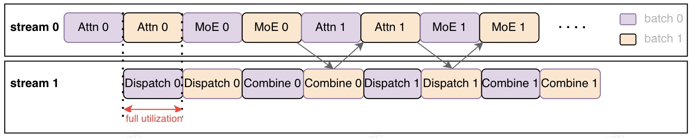

# 多流并行

## 背景
大模型分布式推理场景中需要引入额外的通信操作，将不同设备上的计算结果聚合在一起。以Deepseek这类大规模的MoE模型为例，分布式规模通常较大，通信开销也会随之变大。计算和通信都采用同一个stream的话，在通信的同时，device计算资源会出现浪费，一直等待通信完成才能开始后面的计算。


## 功能介绍
xLLM在模型图层支持了多流并行功能，将输入的batch拆分成2个micro batches，一个流执行一个micro batch的计算操作，另一个流执行另一个micro batch的通信操作，计算和通信同时执行，从而掩盖通信开销。



## 使用方式

xLLM中提供了gflags参数`enable_multi_stream_parallel`，默认false，如需开启在xLLM的服务启动脚本中设置为true即可，示例如下：
```shell
--enable_multi_stream_parallel=true
```


## 性能效果
prefill双流并行开启后，基本可掩盖75以上的通信开销，在DeepSeek-R1模型上，只输出1个token的情况下

- TTFT下降 **7%**
- 吞吐 **提升7%**


!!! warning "注意"
    双流并行目前只支持prefill阶段，请求输入越长，收益越大。
    目前仅支持DeepSeek、Qwen3 dense（非MoE）模型。