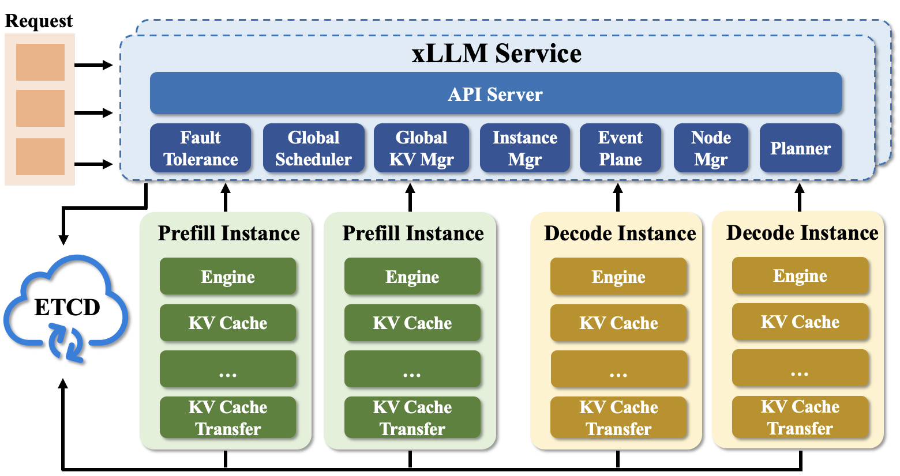

# xLLM Service
[:simple-github: xLLM Service](https://github.com/jd-opensource/xllm-service)

## 简介

**xLLM-service** 是一个基于 xLLM 推理引擎开发的服务层框架，为集群化部署提供高效率、高容错、高灵活性的大模型推理服务。

xLLM-service 旨在解决企业级服务场景中的关键挑战：

- 如何于在离线混合部署环境中，保障在线服务的SLA，提升离线任务的资源利用率。
- 如何适应实际业务中动态变化的请求负载，如输入/输出长度出现剧烈波动。
- 解决多模态模型请求的性能瓶颈。
- 保障集群计算实例的高可靠性。

#### 背景
当前，百亿至万亿参数规模的大语言模型正快速部署于智能客服、实时推荐、内容生成等核心业务场景，对国产计算硬件的高效支持已成为低成本推理部署的核心需求。现有推理引擎难以有效适配国产芯片等专用加速器的架构特性，硬件计算单元利用率低、MoE 架构下的负载不均衡与通信开销瓶颈、kv 缓存管理困难等问题，制约了请求的高效推理与系统的可扩展性。xLLM-service + xLLM推理引擎提升了全链路效率，为大语言模型在实际业务中的规模化落地提供了关键技术支撑。

--- 

## 整体架构
xLLM-service 整体架构如图所示:

## 核心组件

### ETCD Cluster
用于元信息管理，包括模型，xllm实例，请求等元信息的存储与管理。同时提供xllm节点注册与发现服务。

### Fault Tolerance
xLLM-service 提供容错管理，保障服务质量以及稳定性。

### Global Scheduler
实现全局感知调度，根据当前系统状态，将请求精准调度至最优实例执行，有效提升整体服务响应效率与资源利用率。

### Global KV Cache Manager
负责全局 KV Cache 管理，核心能力包括分布式 KV 缓存感知、Prefix 前缀匹配、KV Cache 动态迁移等，优化缓存资源使用效率。

### Instance Manager
聚焦实例全生命周期管理，所有 xllm 实例启动后需向本模块注册，模块基于预设策略，为实例提供调度适配、容错处理等支持。

### Event Plane
作为指标与事件中枢，接收各实例上报的 Metrics 数据，对统计指标进行统一收集与整理，为服务调度、容错、扩缩容等决策提供数据支撑。

### Planner
承担策略分析与决策职能，基于 Event Plane 上报的 Metrics 数据（含实例运行时指标、机器负载指标等），分析服务扩缩容需求、热点实例扩展必要性，输出资源调整与实例优化策略。